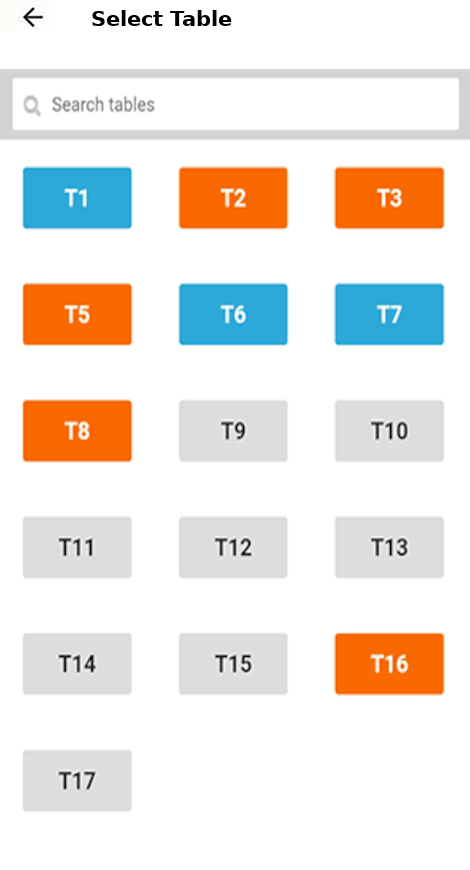
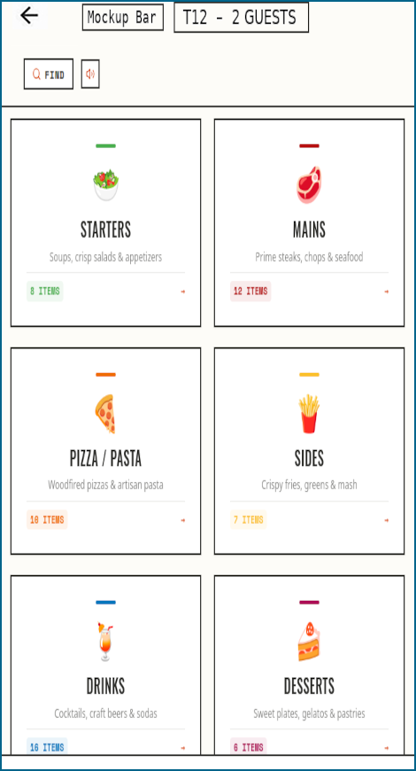
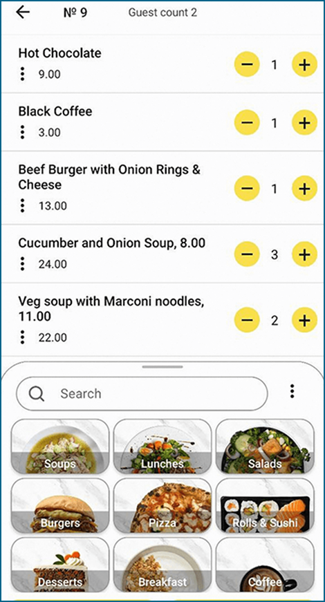

|||
| --- | --- |
||ASP.NET gastronomy system: Simplifies "taking orders" for the waitstaff etc. with an easy to adapt (to your needs) server-cients approach even capable of handling customers "table-swaps / &#8209;mergers" etc.|

## Screens (mockups so far...)
<figure>

<figuretext>(1) Table selector</figuretext>
</figure>
 
 
 
<figure>

<figuretext>(2) Food group selector</figuretext>
</figure>
 
 
 
<figure>

<figuretext>(3) Finished order</figuretext>
</figure>
 
